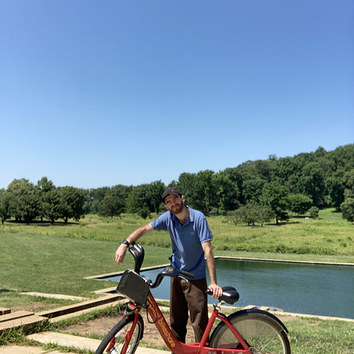

  

    <h1>Hello, I'm Alex!</h1>
    
I'm your stereotypical nerdy data scientist guiding organizations in making sense of their data to make well-informed decisions. I love exploring how software can be used to make our lives better, in addition to seeing how it changes cultural norms, locally and globally.

  

  

    
  

## Who Am I?

I didn’t start with data science. In fact, I wanted to be an industrial-organizational (IO) psychologist, and my masters is in sustainability management from [Stevens Institute of Technology](https://www.stevens.edu/). (I studied environmental science at [Cornell University](https://www.cornell.edu/).)

I've always been driven to achieving [sustainability goals](https://sdgs.un.org/goals). On a service trip to Haiti in 2013, I saw how waste management infrastructure affects the economy and culture. Without dumpsters, garbage trucks, and recycling bins, littering, dumping, and open burning resulted in a vicious cycle of crime; loss of natural beauty; and air, soil, and water pollution. The truth was in the data. Island nations will bear losses of almost [$2.5 billion per year](https://pubmed.ncbi.nlm.nih.gov/31232294/) if we cannot transform the outdated make-take-waste model. I became a lover of garbage, the most visual aspect of sustainability challenges. This experience sparked my passion for sustainability and began my career in data science, where I use data to drive positive change.

Ironically, I stayed away from programming to conduct data analysis. All through college and until graduate school, I did not use any programming languages. But when I learned R (~6 years), I fell in love with R Studio, the command line, git, and all that software development entailed.

---

## Highlights

- Developed waste diversion recommendations for the [Trust for Governors Island](https://www.govisland.com/about/the-trust-for-governors-island) by analyzing a 2018 waste audit (Excel).
- Published a 7-page [report](https://reports.aashe.org/institutions/stevens-institute-of-technology-nj/report/2020-03-02/AC/curriculum/AC-6/) on sustainability aptitute for Stevens Institute of Technology by developing, disbursing, and analyzing the results of a campus-wide survey in 2020, in addition to recommending best practices for educating students on environmental sustainability (Excel).
- Published a 10-page report profiling greenhouse gas (GHG) emissions of [Dairy Farmers of America (DFA)](https://www.dfamilk.com/) prominent sources, showing viability of achieving its Science-based Target (SBT) in 2020 (R and Markdown).
- Visualized how well students incorporate sustainability into their engineering capstone design projects, comparing their grades on sustainability assessments against their final grades, and presented results at a [peer conference](https://strategy.asee.org/assessing-the-sustainability-components-of-engineering-capstone-projects) in 2021 (R and Markdown).

I make software and data projects for fun, too. Those can be found in [Projects](projects.md).

---

## Tools

- **Programming**: Python, SQL/NoSQL, HTML/CSS, JavaScript/TypeScript
- **Data science packages**: IPython/Jupyter, Pandas, NumPy, Matplotlib, Seaborn, 
- **No-code programming**: Tableau, Notion, Airtable, Power BI
- **Developer tools**: Zsh, Bash, CLI (Linux), Git, GitHub, Postman, Markdown, LaTeX, Google Colab, Anaconda, Visual Studio Code, PyCharm, Word, Excel, PowerPoint

---

## Anything Else?

I love to bike, learn, volunteer, swim, spend time with friends...all of the nerdy stuff you'd expect from someone who likes to play on his computer. I also [blog](https://furry-date-ae4.notion.site/Rethinking-Circular-Economy-34b44ede819c49158d207ac18607e85d) regularly: on civic issues, reducing food waste, recycling, startups, and so much more. Whatever crosses my mind and I have an insight, I write about it.

<footer>
    

        
        
        
    

</footer>